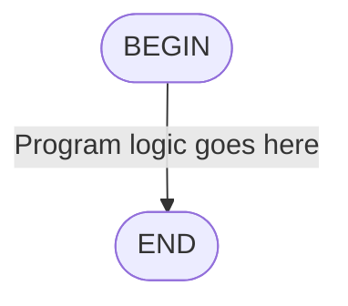
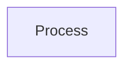
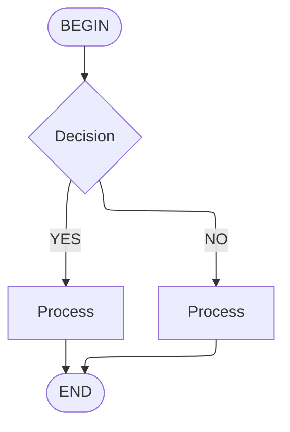
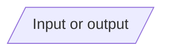
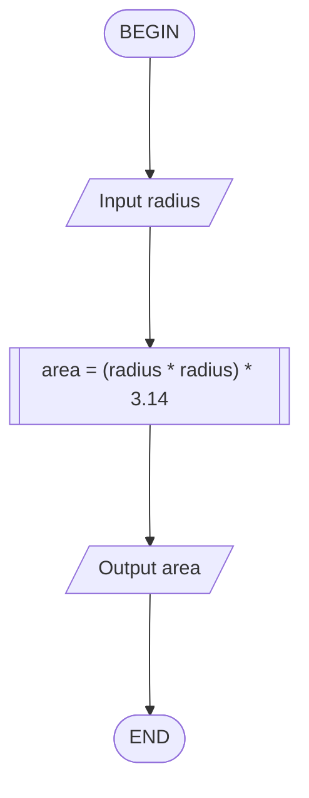
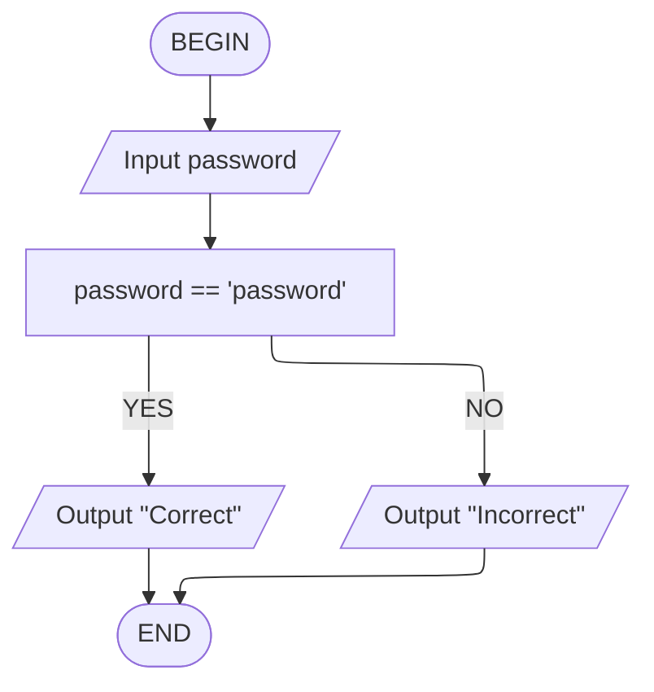

---
authors:
  - "0x4248"
tags:
  - Other
  - Logic
aliases:
  - flowchart
  - Flowchart's
  - flowchart's
---
**Note:** This article refers to flowcharts in computer science and programming
<hr>

In computer science a **flowchart** is a visual diagram that shows the data flow and logic a [[Computer|computer]] system. A flowchart will show the start and end, inputs, outputs and steps that are taken to complete a task. A flowcharts are used commonly in computer science to help analyse, design and document how a system works.
## Symbols
There are several key symbols that are used in a flow charts to represent different parts of a program.
### Start end
The start and end of a flowchart is represented by a rounded rectangle. This is to show that the program has started and ended.


### Process
A process is represented by a rectangle. This is used to show a step in the program.


### Decision
A decision is represented by a diamond. If the result of what is in the diamond is true then the program will go one way, if it is false it will go another.

### Input/Output
An input output is represented by a parallelogram. This is used to show where the program takes in input or outputs data.

## Design rules
Flow charts must always have a start and end and use straight lines to connect the symbols.

In `mermaid.js` you can use the `config` tag to set the default renderer to `elk` to make the flowchart look better.
```
---
config:
    flowchart:
        defaultRenderer: elk
---
```
### Calculate the area of a circle
In this example we take in the input of a radius and output the area of a circle using the formula:
$$
area = \pi * radius^2
$$
The flow chart for this program would look like this:

If we wrote this in python it would look like this:
```python
import math

radius = float(input("Enter the radius of the circle: "))
area = math.pi * radius ** 2
print(f"The area of the circle is {area}")
```
<div>
	<!-- TEMPLATE: CC-0 Code license -->
	<p style="color:gray;margin:0;">Code shown licensed under the <strong>public domain</strong> (CC-0) <a style="color:gray;" href="https://creativecommons.org/public-domain/cc0/">More info</a></p>
</div>

### Password checker
In this example we take in a string and compare it with another string to see if they are the same. If they are the same we output `Correct` if they are not we output `Incorrect`.

If this was written in python it would look like this:
```python
password = input("Enter the password: ")
if password == "password":
    print("Correct")
else:
    print("Incorrect")
```
<div>
	<!-- TEMPLATE: CC-0 Code license -->
	<p style="color:gray;margin:0;">Code shown licensed under the <strong>public domain</strong> (CC-0) <a style="color:gray;" href="https://creativecommons.org/public-domain/cc0/">More info</a></p>
</div>

---
## See also
- [[Programming]]